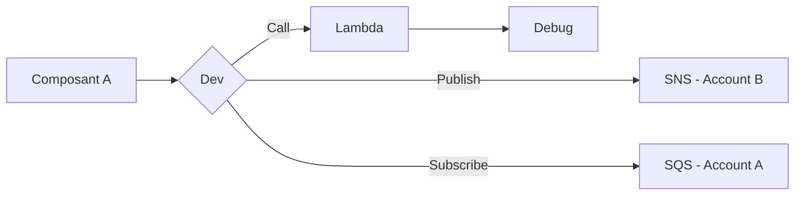

Example of content Tab disposition

## Detailed config

=== ".NET"

    |         Component         | Version | Latest |                   Updated                   |
    | :-----------------------: | :-----: | :----: | :-----------------------------------------: |
    |         .NET Core         |   3.1   |  3.1   | :fontawesome-solid-circle-check:{ .green }  |
    |       .NET Core SDK       |   3.1   | 4.1.1  |  :fontawesome-solid-circle-xmark: { .red }  |
    |     .NET Core Runtime     |   3.1   |  3.1   | :fontawesome-solid-circle-check:{ .green }  |
    | .NET Core ASP.NET Runtime |  3.0.2  | 3.1.1  | :fontawesome-solid-circle-minus:{ .yellow } |

=== "Terraform"

    :fontawesome-brands-twitter:{ .twitter }
    :fontawesome-brands-twitter:{ .twitter }
    :fontawesome-brands-twitter:{ .twitter }
    :fontawesome-brands-twitter:{ .twitter }
    :fontawesome-brands-twitter:{ .twitter }

## Graph dependencies

